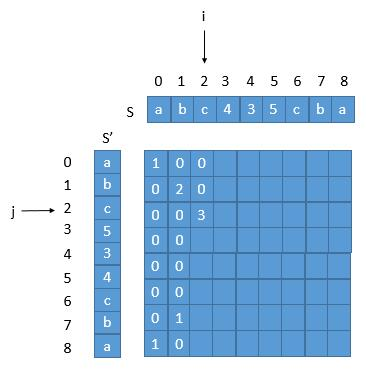

# 字符串

## 最长公共子串

状态转移方程如下：
$$
d p[i][j]=\left\{\begin{array}{l}
d p[i-1][j-1]+1, \text { 当且仅当 } x[i]=y[j] \\
0, \text { 当 } x[i] \ne y[j]
\end{array}\right.
$$
按照上面方程实现的算法时间复杂度为 $O(n^2)$，空间复杂度为 $O(n^2)$。



注意到，更新 $dp[i][j]$ 只需要上一列，即 $dp[i-1]$ 列，所以可以将空间复杂度降低为 $O(n)$，但是需要注意因为使用的是相同的数组列，所以字符串不相等时需要设置 $dp[j] = 0$，同时要注意从后向前更新数组，因为如果从前向后更新，那么当前的 $dp[j]$ 使用的是当前列刚刚更新过的数据，而我们需要的是上一列的数据，所以可以从后向前更新数据避免这个问题。

rust 代码如下：

```rust
let mut dp = vec![0; s2.len()];
for i in 0..s1.len() {
    // 逆序迭代是因为更新a[i][j]需要a[i-1][j-1]
    // 现在是一个数组，所以 a[j] 是原来的 a[i][j]，而我们需要的是 a[i-1][j]
    // 所以从后向前迭代，a[j] 是原来的 a[i-1][j]
    for j in (0..s2.len()).s2() {
        if s[i] == s2[j] {
            if i == 0 || j == 0 {
                dp[j] = 1;
            } else {
                dp[j] = dp[j - 1] + 1;
            }
            if dp[j] > max_len {
                let before_s2 = s2.len() - 1 - j;
                if before_s2 + dp[j] - 1 == i {
                    max_len = dp[j];
                    max_end = i;
                }
            }
        } else {
            // 与之前不同，之前使用的是不同的列，所以不需要置0
            dp[j] = 0;
        }
    }
}
```

## 最长回文子串

### 动态规划

将字符串倒置之后求最长公共子串，并判断是否为回文子串，这里回文子串「由倒置字符串推出的原字符串末尾下标」与「i」应该相等。

代码中 `longest_palindrome1` 的求最长公共子串空间复杂度为 $O(n^2)$，`longest_palindrome2` 的求最长公共子串空间复杂度为 $O(n)$。

代码如下：

```rust
struct Solution;

impl Solution {
    pub fn longest_palindrome1(s: String) -> String {
        if s.len() <= 1 {
            return s;
        }
        let rev: String = s.chars().rev().collect();
        let rev = rev.as_bytes();
        let s = s.as_bytes();
        let mut dp = vec![vec![0; rev.len()]; s.len()];
        let mut max_len = 0;
        let mut max_end = 0;
        for i in 0..s.len() {
            for j in 0..rev.len() {
                if s[i] == rev[j] {
                    if i == 0 || j == 0 {
                        dp[i][j] = 1;
                    } else {
                        dp[i][j] = dp[i - 1][j - 1] + 1;
                    }
                }
                if dp[i][j] > max_len {
                    // 如果是回文串，那么「由倒置字符串推出的原字符串末尾下标」与「i」应该相等
                    // 其中，倒置字符串的 rev.len() - 1 - j，也就是倒置之前的开始下标，减一是因为长度比下标多一
                    // 再加上 dp[i][j] - 1，就是原字符串的末尾下标。abc，a的下标为0，长度为3，0+3为3，但是最大下标为2，所以需要减一
                    let before_rev = rev.len() - 1 - j;
                    if before_rev + dp[i][j] - 1 == i {
                        max_len = dp[i][j];
                        max_end = i;
                    }
                }
            }
        }
        std::str::from_utf8(&s[max_end + 1 - max_len..max_end + 1])
            .unwrap()
            .to_string()
    }
    pub fn longest_palindrome2(s: String) -> String {
        if s.len() < 1 {
            return s;
        }
        let rev: String = s.chars().rev().collect();
        let s = s.as_bytes();
        let rev = rev.as_bytes();
        let mut max_len = 0;
        let mut max_end = 0;
        let mut dp = vec![0; rev.len()];
        for i in 0..s.len() {
            // 逆序迭代是因为更新a[i][j]需要a[i-1][j-1]
            // 现在是一个数组，所以 a[j] 是原来的 a[i][j]，而我们需要的是 a[i-1][j]
            // 所以从后向前迭代，a[j] 是原来的 a[i-1][j]
            for j in (0..rev.len()).rev() {
                if s[i] == rev[j] {
                    if i == 0 || j == 0 {
                        dp[j] = 1;
                    } else {
                        dp[j] = dp[j - 1] + 1;
                    }
                    if dp[j] > max_len {
                        let before_rev = rev.len() - 1 - j;
                        if before_rev + dp[j] - 1 == i {
                            max_len = dp[j];
                            max_end = i;
                        }
                    }
                } else {
                    // 与之前不同，之前使用的是不同的列，所以不需要置0
                    dp[j] = 0;
                }
            }
        }
        std::str::from_utf8(&s[max_end + 1 - max_len..max_end + 1])
            .unwrap()
            .to_string()
    }
}
```

### Manacher 算法
